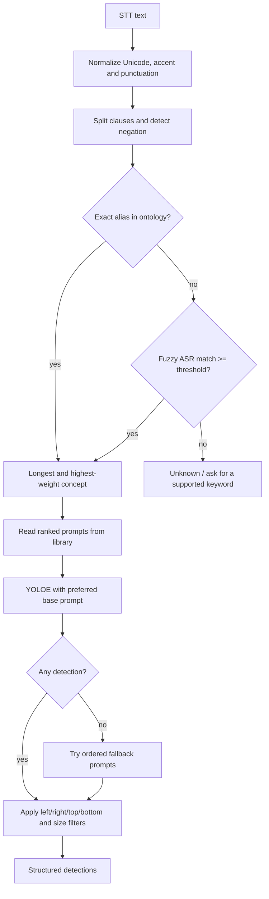

# Thiết kế hiểu ngữ cảnh bằng Tree + Prompt Library

## Mục tiêu

Đầu vào là text/keyword từ Speech-to-Text. Đầu ra không phải một câu tự do mà
là một kế hoạch có cấu trúc gồm concept, prompt YOLOE, fallback prompt và các
điều kiện hậu xử lý.

Ví dụ:

```text
"tìm chai nước to nhất ở bên phải"
               |
               v
concept       = water_bottle
YOLOE prompt  = bottle
spatial       = right
selection     = largest
fallback      = [water bottle, plastic bottle]
```

## Decision tree



## Vì sao tách context khỏi prompt

`blue water bottle on the right` chứa ba loại thông tin khác nhau:

- `water_bottle`: semantic concept.
- `blue`: visual attribute.
- `right`: quan hệ với khung ảnh.

YOLOE chỉ cần prompt có recall tốt (`bottle`). `right` được lọc bằng tâm bounding
box; `largest` được lọc bằng diện tích box. Việc đưa toàn bộ câu vào text encoder
làm embedding cụ thể hơn nhưng có thể giảm recall. Benchmark hiện tại xác nhận
`bottle` tốt hơn đáng kể so với `water bottle` trên checkpoint đang dùng.

## Library

`prompt_library.json` là phần duy nhất cần chỉnh khi thêm object:

- `ontology_path`: vị trí trong cây khái niệm.
- `aliases`: từ tiếng Việt, tiếng Anh và các biến thể STT.
- `prompts`: prompt đã xếp hạng bằng benchmark.
- `modifiers`: màu, vị trí và phép chọn.

Thêm vocabulary không cần sửa inference code.

## Trạng thái prototype

Đã hỗ trợ:

- Tiếng Việt có dấu/không dấu và English.
- Whole-token matching, tránh match `chair` trong `chairman`.
- Fuzzy fallback cho lỗi ASR như `chai nuok`.
- Phủ định theo clause.
- Màu, trái/phải/giữa/trên/dưới, lớn nhất/nhỏ nhất.
- Prompt fallback khi prompt chính không detect được.
- Benchmark prompt tự động trên dataset có mask.

Chưa hỗ trợ đầy đủ:

- Nhiều target trong cùng một lệnh; prototype trả trạng thái ambiguous.
- Tham chiếu hội thoại như `nó`, `cái đó`; cần session state và TTL.
- Color post-filter; hiện màu được parse nhưng chưa dùng để loại box.
- `nearest`; cần median depth từ pipeline RGB-D.

Các giới hạn này nên được thêm ở tầng rule/state, không cần đưa LLM vào pipeline.
